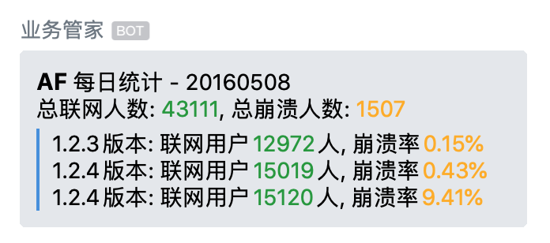
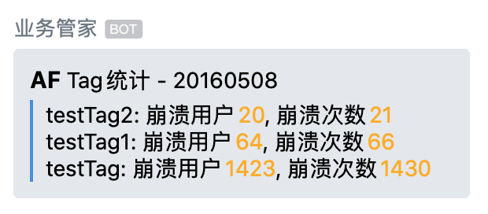
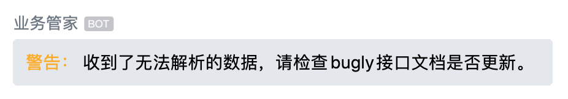

# Bugly_Webhook_to_WorkWeixin_Bot

## 工作流程

1. Bugly 向云函数发送数据
2. 云函数收到并解析，按业务需求处理后，转发至企业微信群 bot（**本 repo 用途**）
3. 企业微信群 bot 推送消息

## 使用方式

- 阿里云计算函数，新建函数==>模板函数==>flask-web
- 替换`main.py`内容，把企业微信群 bot 的回调地址赋值给`bot_url`
- 在 bugly 产品后台设置 webhook 地址为：计算函数 http 触发器路径

测试：向计算函数随意发一个 post 请求，如果企业微信的机器人弹出消息，就说明接入成功。

## 说明

按照 Bugly 文档（2020.02.22）自定义接入部分做了解析，可以接受`每日Crash趋势`和`TAG Crash统计`全部两种事件类型。

> 特性：对于 post 类型的请求做了处理，所有格式的数据（包括空请求），即使无法解析，也会向机器人推送消息。就算接口改变也不会漏掉。

推送的消息如下，可根据实际所需修改模板：

每日趋势

Tag

其它数据

## 参考链接

[Bugly Webhook 接入指南 - 自定义接入](https://bugly.qq.com/docs/user-guide/webhook-bugly/#_3)

[企业微信 - 如何配置群机器人](https://work.weixin.qq.com/help?doc_id=13376)

